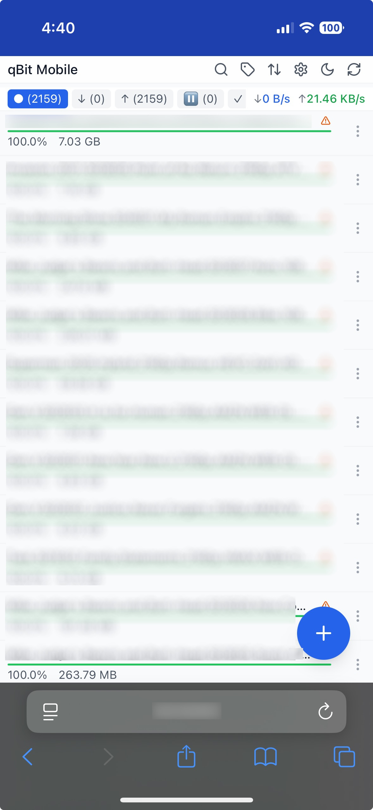
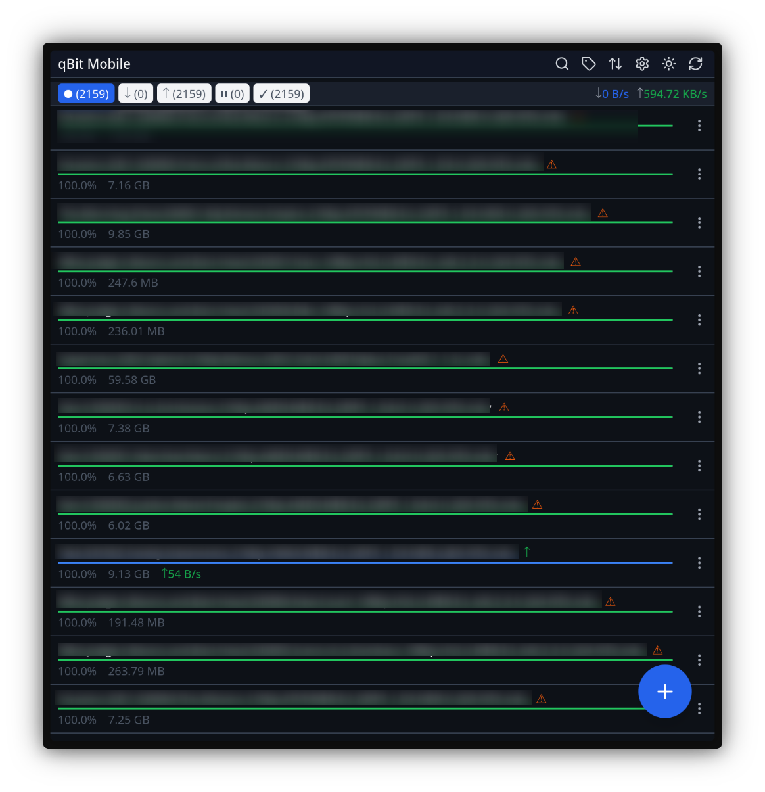

# qBit Mobile

A modern, responsive web interface for qBittorrent optimized for mobile devices. Designed as a lightweight alternative to the default WebUI with a focus on mobile usability and touch-friendly controls.

## Screenshots

<details>
<summary>View Screenshots</summary>

### Mobile View (iOS)


### Desktop View


</details>

## Features

- 📱 **Mobile-first design** - Optimized for iOS and Android browsers
- ⚡ **Fast and lightweight** - Minimal resource usage, instant interactions
- 🌙 **Dark mode support** - Automatic theme switching with manual override
- 🔍 **Search and filter** - Real-time torrent search and status filtering
- 🏷️ **Tag-based organization** - Filter torrents by tags
- 📊 **Real-time statistics** - Live download/upload speeds and progress
- 🔄 **Auto-refresh** - Automatic updates every 5 seconds
- 🎯 **Touch-optimized** - Swipe actions and touch-friendly controls
- 🔐 **Secure** - Supports authentication and local bypass

## Requirements

- Node.js 18+
- qBittorrent with Web UI enabled
- qBittorrent configured to allow local authentication bypass (recommended) or with credentials

## Installation

### Quick Deploy (Linux)

```bash
# Clone the repository
git clone https://github.com/yourusername/qbit-mobile.git
cd qbit-mobile

# Run the interactive deployment script as root
sudo ./deploy.sh
```

### Uninstall

```bash
# To completely remove qBit Mobile
sudo ./uninstall.sh
```

The deployment script will:
- Detect existing installations and perform updates gracefully
- Install dependencies and build the production bundle
- Interactively configure qBittorrent connection settings
- Create a dedicated system user for security (fresh installs)
- Set up and manage the systemd service
- Preserve existing configurations during updates

### Manual Installation

1. Clone the repository:
```bash
git clone https://github.com/roethlar/qbit-mobile.git
cd qbit-mobile
```

2. Install dependencies:
```bash
npm install
```

3. Build the frontend:
```bash
npm run build
```

4. Configure environment variables:
```bash
cp .env.example .env
# Edit .env with your qBittorrent settings
# Or simply run sudo ./deploy.sh for an interactive setup on the target machine
```

5. Start the server:
```bash
npm start
```

## Configuration

Edit the `.env` file to configure the connection to qBittorrent (the deploy script will help you create this interactively):

```env
NODE_ENV=production
PORT=3000                      # Port for the web interface
HOST=0.0.0.0                  # Host to bind to
QBITTORRENT_HOST=localhost    # qBittorrent host
QBITTORRENT_PORT=8080         # qBittorrent WebUI port
QBITTORRENT_USERNAME=         # optional; leave blank for local bypass
QBITTORRENT_PASSWORD=         # optional; leave blank for local bypass
```

### qBittorrent Configuration

For the best experience, configure qBittorrent to allow local authentication bypass:

1. Open qBittorrent settings
2. Go to Web UI section
3. Enable "Bypass authentication for clients on localhost"

## Development

```bash
# Install dependencies
npm install

# Run development server with hot reload
npm run dev

# Build for production
npm run build

# Start production server
npm start
```

## Systemd Service

After running the deployment script, you can manage the service with:

```bash
# Check status
systemctl status qbit-mobile

# View logs
journalctl -u qbit-mobile -f

# Restart service
systemctl restart qbit-mobile

# Stop service
systemctl stop qbit-mobile
```

## Technologies Used

- **Frontend**: React, TypeScript, Tailwind CSS, Vite
- **Backend**: Node.js, Express
- **State Management**: TanStack Query (React Query)
- **Icons**: Lucide React

## License

MIT

## Contributing

Pull requests are welcome! Please feel free to submit a PR.

## Troubleshooting

### Common Issues

- **Settings page fails to load**: Ensure qBittorrent WebUI is enabled and accessible
- **Authentication errors**: Check that local bypass is enabled in qBittorrent or credentials are correct in `.env`
- **Service won't start**: Check logs with `journalctl -u qbit-mobile -n 50`
- **Port already in use**: Change the PORT in `.env` file

## Support

If you encounter any issues, please report them on the [GitHub issues page](https://github.com/yourusername/qbit-mobile/issues).

## Notes on Compatibility and Security

- Dedicated user: The service runs as a dedicated system user `qbitmobile` rather than `nobody`, which improves compatibility on distributions like Arch and follows least-privilege best practices.
- Permissions: The app directory `/opt/qbit-mobile` is owned by `qbitmobile:qbitmobile` with mode `750`, and the `.env` is `640`. This allows the service to read configuration while keeping it private from other users.
- Write access: The service has write access only to the `dist/` directory (configured via systemd `ReadWritePaths`), and otherwise runs with systemd hardening options enabled.
