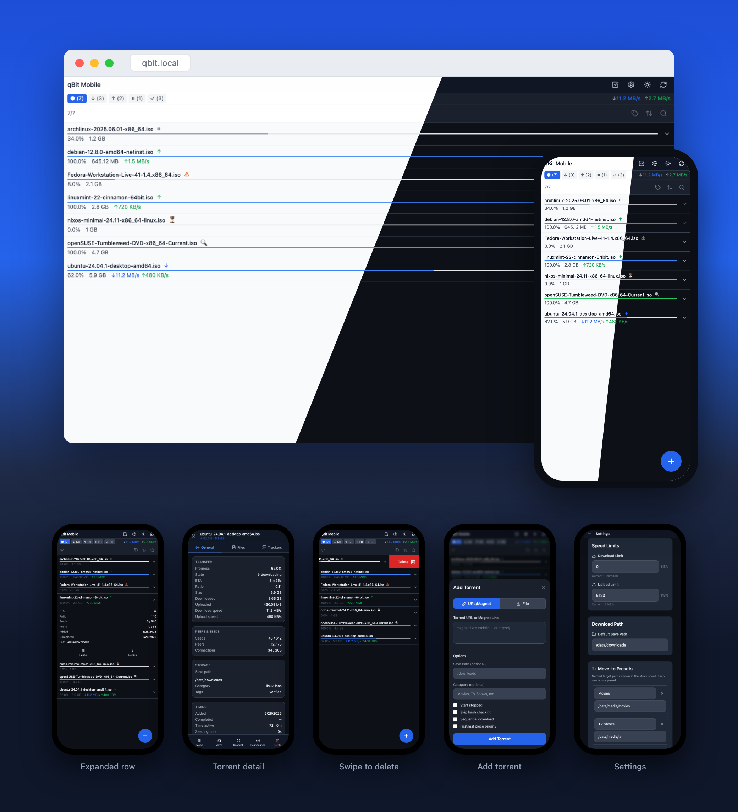

# qBit Mobile

A modern, responsive web interface for qBittorrent optimized for mobile devices.

## Features

- Mobile-first responsive design with dark mode
- Virtualized torrent list (handles thousands of torrents smoothly)
- Per-torrent detail drawer: files, trackers, transfer stats, recheck and reannounce
- Batch selection mode for bulk pause / resume / delete
- Search, sort, tag filtering, and live global stats
- Installable PWA with offline shell (the UI loads from cache; live torrent data needs a connection)
- HTTP Basic auth and an endpoint allowlist so the proxy can't drive the qBittorrent admin API beyond what the UI uses

## Screenshots

<p align="center">
  
</p>

## Requirements

- Node.js 22.12+ (Vite 8 requires `^20.19.0 || >=22.12.0`)
- qBittorrent with Web UI enabled
- qBittorrent configured to allow local authentication bypass (recommended) or with credentials

## Installation

### Quick Deploy

Pick the script for your platform. Each one builds the frontend, prompts for `.env` settings, generates a strong password if you leave it blank, and registers a service that auto-starts.

**Linux** (systemd, requires root):

```bash
git clone https://github.com/roethlar/qbit-mobile.git
cd qbit-mobile
sudo ./deploy.sh
```

Installs to `/opt/qbit-mobile`, runs as a dedicated `qbitmobile` system user under a hardened systemd unit, persists data under `/opt/qbit-mobile/data`.

**macOS** (launchd LaunchAgent, no sudo):

```bash
git clone https://github.com/roethlar/qbit-mobile.git
cd qbit-mobile
./deploy-macos.sh
```

Installs to `~/Library/Application Support/qbit-mobile`, runs as the current user via a user-scoped LaunchAgent (`com.qbit-mobile`), logs to `~/Library/Logs/qbit-mobile.log`. Starts at login.

**Windows** (Scheduled Task at logon, PowerShell 7+):

```powershell
git clone https://github.com/roethlar/qbit-mobile.git
cd qbit-mobile
pwsh .\deploy.ps1
```

Installs to `%LOCALAPPDATA%\qbit-mobile`, registers a per-user Scheduled Task that runs `node.exe server\server.js` hidden at logon, logs to `%LOCALAPPDATA%\qbit-mobile\logs\qbit-mobile.log`. No service install, no UAC prompt.

### Uninstall

```bash
sudo ./uninstall.sh          # Linux
./uninstall-macos.sh         # macOS
pwsh .\uninstall.ps1         # Windows
```

### Manual Installation

1. Clone the repository:
```bash
git clone https://github.com/roethlar/qbit-mobile.git
cd qbit-mobile
```

2. Install dependencies:
```bash
npm install
```

3. Build the frontend:
```bash
npm run build
```

4. Configure environment variables:
```bash
cp .env.example .env
# Edit .env with your qBittorrent settings
# Or simply run sudo ./deploy.sh for an interactive setup on the target machine
```

5. Start the server:
```bash
npm start
```

## Configuration

Edit the `.env` file to configure the server (the deploy script writes one for you interactively):

```env
NODE_ENV=production
PORT=3000                      # Port for the web interface
HOST=0.0.0.0                   # Host to bind to

# App authentication
AUTH_MODE=basic                # 'basic' (default) or 'disabled'
APP_USERNAME=admin
APP_PASSWORD=                  # required if AUTH_MODE=basic

# Upstream qBittorrent
QBITTORRENT_HOST=localhost
QBITTORRENT_PORT=8080
QBITTORRENT_USERNAME=          # optional; leave blank for local bypass
QBITTORRENT_PASSWORD=

# Reverse proxy / CORS (optional)
TRUST_PROXY=                   # set when behind a proxy that sets X-Forwarded-* headers
ALLOWED_ORIGIN=                # allow exactly one extra cross-origin web client
```

### App authentication

This app is designed to be reached from a phone on your LAN, so binding to `0.0.0.0` is the default. To keep that safe, `AUTH_MODE=basic` is enabled out of the box and the server refuses to start if `APP_USERNAME` / `APP_PASSWORD` are unset. `deploy.sh` will auto-generate a strong password if you leave the field blank during install and print it once at the end.

`AUTH_MODE=disabled` is available for trusted-LAN setups where you've already gated access at the network or reverse-proxy layer. The server prints a loud warning at boot if it's disabled while bound to a non-loopback interface.

The proxy only forwards a curated set of qBittorrent endpoints — `/torrents/{info,properties,files,trackers}`, `/transfer/info`, `/app/{preferences,version,webapiVersion}`, `/torrents/{stop,start,delete,add,recheck,reannounce,setLocation}`, and `/app/setPreferences` (with a key allowlist). Dangerous endpoints like `/app/shutdown` and RCE-enabling preference keys like `autorun_program` are not reachable through the proxy even when authenticated. The add-torrent endpoint also gates its form fields against an allowlist, and path-writing fields (`savepath`, like `setLocation` and `save_path`) are length-bounded and rejected if they contain control characters.

### Reverse proxy and CORS

Both settings are optional and only matter for specific deployments — leave them blank otherwise.

- `TRUST_PROXY` — set this when the app runs behind a reverse proxy (nginx, Caddy, Traefik) that terminates TLS and sets `X-Forwarded-*` headers, so the server reads the real client protocol and IP. The value is passed straight to Express's [`trust proxy`](https://expressjs.com/en/guide/behind-proxies.html) setting: use `1` to trust one proxy hop, or a keyword like `loopback`, `linklocal`, or `uniquelocal`.
- `ALLOWED_ORIGIN` — same-origin browser requests (the app calling its own server) work without this. Set it only when a separate web origin must call the API; it whitelists exactly one extra origin (e.g. `https://qbit.example.com`) for cross-origin requests. Cross-origin writes are rejected when it's unset.

### Move-to location presets

The "Move" action in the row expansion lets you change a torrent's save path (and physically move the downloaded files). The same "Move" sits in the bulk-select toolbar for multi-torrent relocations.

Presets are managed from the Settings page → "Move-to Presets" card: add a row, fill in Name and Path, hit Save. Changes persist to `data/locations.json` in the install directory.

For a first-boot seed before anyone has touched the Settings page, set `DOWNLOAD_LOCATIONS` in `.env`:

```env
DOWNLOAD_LOCATIONS=Movies=/mnt/media/movies|TV=/mnt/media/tv|Music=/mnt/media/music
```

Entries are pipe-separated; each is `Name=/path`. Once the operator saves the list through the UI, the env var is ignored on subsequent boots — the JSON file becomes the source of truth. Users can always type a custom path in the Move sheet too — presets are just shortcuts.

### qBittorrent Configuration

For the best experience, configure qBittorrent to allow local authentication bypass:

1. Open qBittorrent settings
2. Go to Web UI section
3. Enable "Bypass authentication for clients on localhost"

The proxy auto-detects the qBittorrent Web API version and translates legacy endpoints, so qBittorrent 4.x (with `/torrents/pause` / `/torrents/resume`) and 5.x (with `/torrents/stop` / `/torrents/start`) both work without configuration.

## Upgrading from 1.0.x

Version 1.1 adds app-level authentication and several `.env` keys. If you're upgrading an existing install:

- The simplest path is to rerun `sudo ./deploy.sh` and answer "yes" when asked to overwrite `.env`. The script generates a random `APP_PASSWORD` for you and prints it once.
- To upgrade by hand, add these lines to your existing `.env` before restarting the service:

  ```env
  AUTH_MODE=basic
  APP_USERNAME=admin
  APP_PASSWORD=<set a strong password>
  ```

  The server now refuses to boot when `AUTH_MODE=basic` (the default) and the credentials are missing. If your install is on a fully trusted LAN where you'd rather not have auth, set `AUTH_MODE=disabled` instead.

- The proxy now only forwards an allowlist of qBittorrent endpoints. If you're using this app's API directly from a custom client and depended on paths beyond `/torrents/{info,properties,files,trackers,stop,start,delete,add,recheck,reannounce,setLocation}`, `/transfer/info`, and `/app/{preferences,setPreferences,version,webapiVersion}`, open an issue.

## Development

```bash
# Install dependencies
npm install

# Run development server with hot reload
npm run dev

# Build for production
npm run build

# Run tests
npm test

# Start production server
npm start

# Regenerate the README screenshots (headless, mock data)
npm run screenshots
```

The screenshot harness drives the app with a headless browser against mocked
qBittorrent responses; see [`scripts/screenshots/`](scripts/screenshots/) for
setup and details.

## Systemd Service

After running the deployment script, you can manage the service with:

```bash
# Check status
systemctl status qbit-mobile

# View logs
journalctl -u qbit-mobile -f

# Restart service
systemctl restart qbit-mobile

# Stop service
systemctl stop qbit-mobile
```

## Technologies Used

- **Frontend**: React, TypeScript, Tailwind CSS, Vite
- **Backend**: Node.js, Express
- **State Management**: TanStack Query (React Query)
- **Icons**: Lucide React

## License

MIT

## Contributing

Pull requests are welcome! Please feel free to submit a PR.

## Issues

If you encounter any issues, please report them on the [GitHub issues page](https://github.com/roethlar/qbit-mobile/issues).

## Notes on Compatibility and Security

- Dedicated user: The service runs as a dedicated system user `qbitmobile` by default (the deploy script also offers `nobody`), which follows least-privilege best practices and improves compatibility on distributions like Arch.
- Permissions: The app directory `/opt/qbit-mobile` is owned by the service user with mode `750`, and the `.env` is owner-only (`600`) so the password is not readable by group or world.
- systemd hardening: the unit file applies `NoNewPrivileges`, `ProtectSystem=strict`, `ProtectHome`, `ProtectKernel*`, `RestrictAddressFamilies=AF_INET AF_INET6`, an empty `CapabilityBoundingSet`, and a `@system-service` syscall filter. Use `systemd-analyze security qbit-mobile` to inspect.
- App auth on by default: `AUTH_MODE=basic` is the default and the server refuses to boot without credentials. The proxy exposes only an allowlist of qBittorrent endpoints, so even an authenticated caller cannot reach `/app/shutdown` or set RCE-enabling preferences like `autorun_program`.
